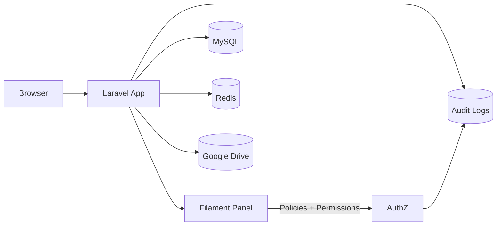
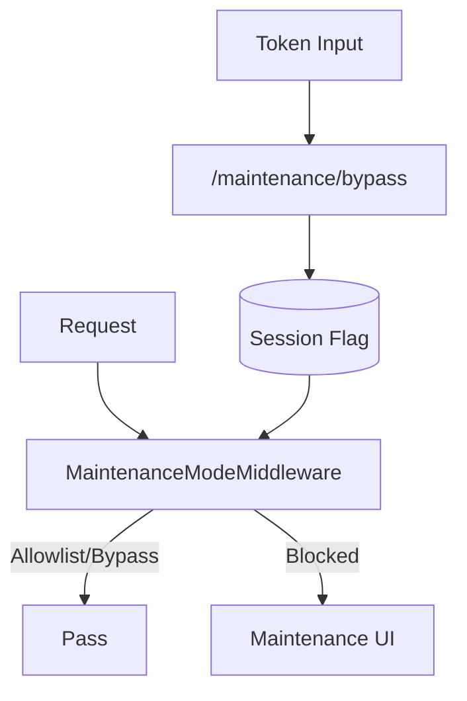
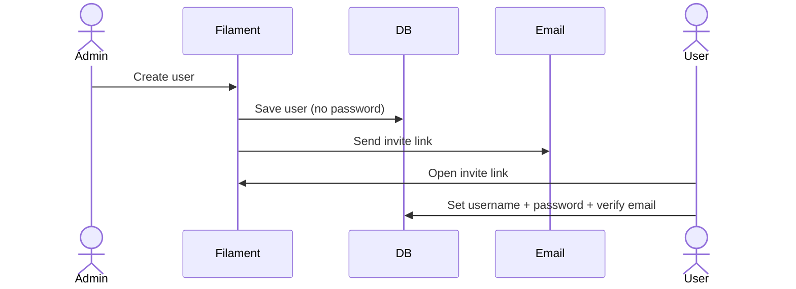
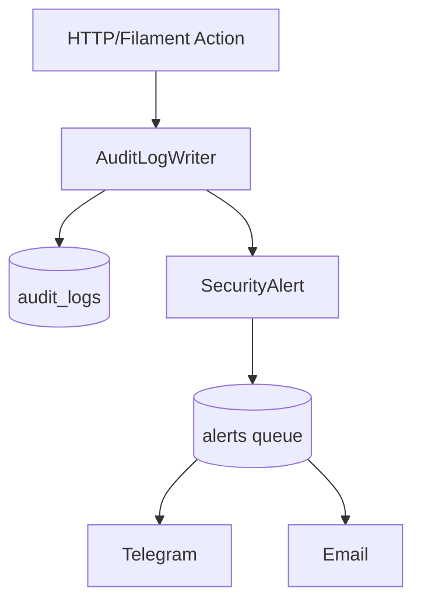

# Warex System

Security-first Laravel 12 + Filament v4 starter for enterprise-grade access control, centralized settings, maintenance orchestration, and auditability.

## Project Status
- Stage: Alpha (internal).
- Scope: Security baseline (auth, audit, maintenance), System Settings, invitation flow, branding + Drive sync, security alerts.

## Key Features
- Filament Shield + Spatie Permission with deny-by-default access control.
- Developer role gets full permission set (explicit, auditable), plus optional validation bypass.
- Centralized System Settings: project identity, branding assets, storage routing, and notifications.
- Maintenance Mode with allow/deny lists, bypass tokens, and scheduled windows.
- Audit trail with tamper-evident hash chain and detailed login activity logging.
- Redis-first cache/session/queue/rate-limit/locks.
- Security alerts via Telegram/email with queue-first delivery and retry/backoff.

## Architecture Overview


## Tech Stack
- Laravel 12
- Filament v4
- Spatie Laravel Permission
- Filament Shield
- MySQL
- Redis
- Google Drive (optional, for branding storage)

## Requirements
- PHP 8.2+
- MySQL 8+ (required; SQLite not supported)
- Redis 6+ (cache/session/queue/rate-limit/locks)

## Quickstart (fresh install)
1) `composer install`
2) `cp .env.example .env` and set `APP_URL`, `DB_*`, and `REDIS_*` (MySQL required; SQLite not supported)
3) `php artisan key:generate`
4) `php artisan migrate:fresh`
5) `php artisan make:filament-user`
6) `php artisan shield:generate --all --panel=admin --option=permissions`
7) `php artisan permission:cache-reset`
8) `php artisan optimize:clear`
9) `php artisan storage:link` (if you use local public fallback)
10) `php artisan serve` and open `http://127.0.0.1:8000/admin`

Queue worker (required for alerts, invitations, and Drive sync):
`php artisan queue:work --queue=default,emails,alerts`

## Testing

Run the test suite using PHPUnit:

```bash
php artisan test
```

Or directly:

```bash
./vendor/bin/phpunit
```

## Role and Permission Model (Shield)
- Developer is immutable and the final authority.
- Superadmin has no bypass; permissions must be explicit.
- No `Gate::before` or global bypass for non-Developer.

Custom permissions:
- `access_admin_panel`
- `assign_roles`
- `execute_user_unlock`
- `execute_user_activate`
- `execute_user_force_password_reset`
- `execute_user_revoke_sessions`
- `execute_maintenance_bypass_token`

Developer access model:
- Developer is auto-synced to all permissions (explicit and auditable).
- Optional bypass for validation checks (email verified, username, password-change, status).
  Enable via `SECURITY_DEVELOPER_BYPASS_VALIDATIONS=true`.

## System Settings
Managed in Filament:
- Project name and description
- Branding (logo, cover, favicon)
- Storage routing (Google Drive or local fallback)
- Notifications (email + Telegram)
- Maintenance mode rules

Branding storage logic:
- Primary disk (default: Google Drive)
- Automatic fallback to local public if Drive fails
- Background sync job to Drive

## Maintenance Mode


Maintenance control:
- Enable/disable, schedule window, and custom message
- Allow IPs, roles, paths, routes, API traffic
- Bypass token stored as hash in encrypted secrets

## Invitation-Based Activation


## Audit and Security Alerts
- All authorization denials are logged.
- Security alerts are queued and sent to Telegram first, fallback to email.
- Sensitive fields are redacted in audit logs.
- Hash chain can be verified or rebuilt:
  - `php artisan audit:verify`
  - `php artisan audit:rehash`



### Per-account Log Visibility
- Each user detail view now exposes a dedicated Filament relation manager so you can read login/audit history per account while retaining the full detail of every log entry.
- The relationship reuses Filament’s table schema/filters, consistent iconography, and real-time data coming from `user_login_activities` without spinning up new components.

## Core Env Toggles
Security:
```
SECURITY_ENFORCE_ACCOUNT_STATUS=true
SECURITY_ENFORCE_SESSION_STAMP=true
SECURITY_ENFORCE_EMAIL_VERIFICATION=true
SECURITY_ENFORCE_USERNAME=true
SECURITY_DEVELOPER_BYPASS_VALIDATIONS=true
```

Audit:
```
AUDIT_LOG_ENABLED=true
AUDIT_LOG_ADMIN_PATH=admin
AUDIT_LOG_ADMIN_ALL=true
AUDIT_LOG_METHODS=POST,PUT,PATCH,DELETE
AUDIT_CACHE_STORE=redis
```

Redis:
```
CACHE_STORE=redis
SESSION_DRIVER=redis
QUEUE_CONNECTION=redis
```

## Operational Checklist
- Configure `APP_URL` for signed invitation links.
- Configure DB and Redis credentials.
- Fill Google Drive or local storage settings in System Settings.
- Configure Mail and Telegram credentials.
- Run the Redis-backed queue worker for alerts, invitations, and Drive sync jobs (e.g., `php artisan queue:work --queue=default,emails,alerts --tries=3 --sleep=3 --timeout=90`). Use Supervisor or a process manager in production.
- Review `security.log` and `laravel.log` for warning events.

## Security Hardening
- Filament access flows through the policies in `app/Policies` (UserPolicy, SystemSettingPolicy, AuditLogPolicy, UserLoginActivityPolicy, and RolePolicy), so every action follows Filament Shield/Spatie least-privilege checks before tables or forms render.
- Production requests pierce `EnsureAccountIsActive`, `EnsureUserHasRole`, `EnsureSecurityStampIsValid`, `MaintenanceModeMiddleware`, `RequestIdMiddleware`, `UpdateLastSeenMiddleware`, and `AuditLogMiddleware`, layering account gating, role validation, session stamp integrity, maintenance controls, traceability, telemetry, and tamper-evident audit logging before any UI interaction.
- `AuditLogMiddleware` writes hashed audit entries (supported by `user_login_activities`), while the Redis queue worker (`php artisan queue:work --queue=default,emails,alerts --tries=3 --sleep=3 --timeout=90`) powers security alerts, invitations, and Drive sync jobs so asynchronous flows remain auditable and defense-in-depth compliant.

## Contributing

We welcome contributions! Please follow these steps:

1. Fork the repository.
2. Create a feature branch (`git checkout -b feature/AmazingFeature`).
3. Commit your changes (`git commit -m 'Add some AmazingFeature'`).
4. Push to the branch (`git push origin feature/AmazingFeature`).
5. Open a Pull Request.

## License

This project is licensed under the MIT License. See the [LICENSE](LICENSE) file for more details.

## Authors

- **Halfirzzha** - *Initial work* - [Your GitHub](https://github.com/yourusername)

## Changelog
### v0.1.7 (2025-12-29)
- SystemSetting, UnifiedHistory, and UserLoginActivity Filament tables now surface enterprise-ready empty states (heading, description, heroicon action with a refresh link) so admins always know how to proceed when datasets are still initializing.
- README gained a Security Hardening section and explicit Redis queue worker guidance, documenting how the policies/middleware/audit logging stack secures every UI hardening step.

### v0.1.6 (2025-12-28)
- Added per-account login activity view under each user via native Filament relation manager so logs are scoped per account yet detail entries remain fully accessible.
- Relation manager leverages Filament tables schema, column/responsive layout, and iconography without introducing new standalone components.

### v0.1.5 (2025-12-28)
- User Resource table now shows enterprise-ready empty state messaging and action with consistent Filament icons for desktop/mobile workflows.

### v0.1.4 (2025-12-28)
- Fix Mermaid maintenance diagram label quoting to avoid lexical errors.

### v0.1.3 (2025-12-28)
- Full README rewrite for professional structure, clarity, and operational guidance.
- Explicit MySQL/Redis requirement and `APP_URL` dependency for signed URLs.

### v0.1.2 (2025-12-28)
- Standardize changelog format and add project status and requirements.
- Document MySQL/Redis requirement and APP_URL for signed URLs.

### v0.1.1 (2025-12-28)
- System settings cache is more fault tolerant; branding URLs fall back to secondary disk.
- Invitation links follow database expiry; signed route used when expiry is empty.
- Password hardening: track change metadata, rotate security stamp, enforce expiry.
- Access denied now invalidates sessions to prevent stale auth state.
- Documentation emphasizes MySQL + Redis (SQLite not supported).
