<div align="center">

# 🛡️ Warex System

[](https://laravel.com)
[](https://filamentphp.com)
[](https://php.net)
[](LICENSE)

**Security-first Laravel 12 + Filament v4 enterprise starter kit**

*Access control • Audit trails • Maintenance orchestration • Centralized settings*

[Getting Started](#-quickstart) •
[Features](#-key-features) •
[Architecture](#-architecture-overview) •
[Documentation](#-documentation) •
[Contributing](#-contributing)

</div>

---

## 📊 Project Status

```
┌─────────────────────────────────────────────────────────────────┐
│  Stage: Alpha (Internal Development)                           │
│  Version: 0.1.7                                                 │
│  Last Updated: December 2025                                    │
└─────────────────────────────────────────────────────────────────┘
```

| Module | Status | Description |
|--------|--------|-------------|
| 🔐 Authentication | ✅ Stable | Multi-factor, invitation-based activation |
| 📝 Audit Logging | ✅ Stable | Tamper-evident hash chain |
| 🔧 Maintenance Mode | ✅ Stable | Scheduled windows, bypass tokens |
| ⚙️ System Settings | ✅ Stable | Centralized configuration |
| 🔔 Security Alerts | ✅ Stable | Telegram + Email notifications |
| 🎨 Branding | ✅ Stable | Google Drive sync |

---

## ✨ Key Features

<table>
<tr>
<td width="50%">

### 🔒 Security First
- **Deny-by-default** access control
- Filament Shield + Spatie Permission
- Session stamp validation
- Password history enforcement
- Compromised password detection (HIBP)

</td>
<td width="50%">

### 📋 Enterprise Audit
- **Tamper-evident** hash chain logging
- Detailed login activity tracking
- Sensitive field redaction
- Per-account audit visibility
- Cryptographic integrity verification

</td>
</tr>
<tr>
<td width="50%">

### 🛠️ Maintenance Mode
- Scheduled maintenance windows
- IP/Role/Path allowlists
- Secure bypass tokens
- Real-time status page
- SSE streaming updates

</td>
<td width="50%">

### ⚡ Performance
- **Redis-first** architecture
- Queue-based async processing
- Optimized caching strategies
- Rate limiting & locks
- Background job orchestration

</td>
</tr>
</table>

---

## 🏗️ Architecture Overview

### System Topology

```mermaid
%%{init: {'theme': 'base', 'themeVariables': { 'primaryColor': '#4F46E5', 'primaryTextColor': '#fff', 'primaryBorderColor': '#4338CA', 'lineColor': '#6366F1', 'secondaryColor': '#F1F5F9', 'tertiaryColor': '#E0E7FF'}}}%%
flowchart TB
    subgraph Client["🌐 Client Layer"]
        Browser["🖥️ Browser"]
        API["📱 API Client"]
    end

    subgraph Application["⚙️ Application Layer"]
        Laravel["🔷 Laravel 12"]
        Filament["🟠 Filament v4"]
        Middleware["🛡️ Middleware Stack"]
    end

    subgraph Security["🔐 Security Layer"]
        Auth["Authentication"]
        AuthZ["Authorization"]
        Audit["Audit Logger"]
    end

    subgraph Data["💾 Data Layer"]
        MySQL[("🐬 MySQL 8+")]
        Redis[("🔴 Redis 6+")]
        Drive["☁️ Google Drive"]
    end

    subgraph Queue["📨 Queue Workers"]
        Alerts["🔔 Alerts"]
        Emails["📧 Emails"]
        Sync["🔄 Drive Sync"]
    end

    Browser --> Laravel
    API --> Laravel
    Laravel --> Filament
    Laravel --> Middleware
    Middleware --> Security
    Security --> Auth
    Security --> AuthZ
    Security --> Audit
    Auth --> MySQL
    AuthZ --> Redis
    Audit --> MySQL
    Laravel --> Queue
    Queue --> Alerts
    Queue --> Emails
    Queue --> Sync
    Sync --> Drive
```



### Request Lifecycle


---

## 🔧 Tech Stack


| Category | Technology | Version | Purpose |
|----------|------------|---------|---------|
| **Framework** | Laravel | 12.x | Core application |
| **Admin Panel** | Filament | 4.x | Admin interface |
| **Permissions** | Spatie Permission | Latest | Role-based access |
| **Database** | MySQL | 8.0+ | Primary storage |
| **Cache/Queue** | Redis | 6.0+ | Cache, sessions, queues |
| **Storage** | Google Drive | - | Branding assets |

---

## 📋 Requirements

> ⚠️ **Important:** SQLite is **not supported**. MySQL is required for production features.

| Requirement | Minimum | Recommended |
|-------------|---------|-------------|
| PHP | 8.2 | 8.3+ |
| MySQL | 8.0 | 8.0+ |
| Redis | 6.0 | 7.0+ |
| Composer | 2.0 | Latest |
| Node.js | 18.x | 20.x |

---

## 🚀 Quickstart

### Installation Steps

```bash
# 1. Clone and install dependencies
git clone <repository-url>
cd warex-system
composer install

# 2. Environment setup
cp .env.example .env
php artisan key:generate

# 3. Configure .env (required)
# - Set APP_URL (critical for signed URLs)
# - Set DB_* credentials (MySQL required)
# - Set REDIS_* credentials

# 4. Database setup
php artisan migrate:fresh

# 5. Create admin user
php artisan make:filament-user

# 6. Setup permissions
php artisan shield:generate --all --panel=admin --option=permissions
php artisan permission:cache-reset

# 7. Clear caches
php artisan optimize:clear
php artisan storage:link

# 8. Start the server
php artisan serve
```

### Queue Worker (Required)

```bash
# Development
php artisan queue:work --queue=default,emails,alerts

# Production (with retry/timeout)
php artisan queue:work --queue=default,emails,alerts --tries=3 --sleep=3 --timeout=90
```

> 💡 **Tip:** Use Supervisor in production to manage queue workers.

---

## 🔐 Security Model

### Role Hierarchy

```mermaid
%%{init: {'theme': 'base', 'themeVariables': { 'primaryColor': '#EF4444'}}}%%
graph TD
    subgraph Roles["🎭 Role Hierarchy"]
        DEV["👑 Developer<br/><i>Immutable • Full Access</i>"]
        SUPER["⭐ Superadmin<br/><i>Explicit Permissions Only</i>"]
        ADMIN["🔧 Admin<br/><i>Limited Scope</i>"]
        USER["👤 User<br/><i>Basic Access</i>"]
    end

    DEV --> SUPER
    SUPER --> ADMIN
    ADMIN --> USER

    style DEV fill:#7C3AED,stroke:#5B21B6,color:#fff
    style SUPER fill:#F59E0B,stroke:#D97706,color:#fff
    style ADMIN fill:#3B82F6,stroke:#2563EB,color:#fff
    style USER fill:#6B7280,stroke:#4B5563,color:#fff
```



### Permission Model

| Principle | Implementation |
|-----------|----------------|
| **Deny by Default** | No `Gate::before` or global bypass for non-Developer |
| **Explicit Grants** | All permissions must be explicitly assigned |
| **Immutable Developer** | Developer role is the final authority |
| **Auditable Access** | Every permission check is logged |

### Custom Permissions

```php
// Access Control
'access_admin_panel'
'assign_roles'

// User Management
'execute_user_unlock'
'execute_user_activate'
'execute_user_force_password_reset'
'execute_user_revoke_sessions'

// Maintenance
'execute_maintenance_bypass_token'
```

### Developer Bypass Mode

```env
# Enable validation bypass for developers (dev only!)
SECURITY_DEVELOPER_BYPASS_VALIDATIONS=true
```

When enabled, Developer role bypasses:
- Email verification check
- Username requirement
- Password change enforcement
- Account status validation

---

## ⚙️ System Settings

### Managed Configuration

```mermaid
%%{init: {'theme': 'base'}}%%
graph LR
    subgraph Settings["⚙️ System Settings"]
        P["📝 Project Info"]
        B["🎨 Branding"]
        S["💾 Storage"]
        N["🔔 Notifications"]
        M["🔧 Maintenance"]
    end

    P --> |Name, Description| DB[(Database)]
    B --> |Logo, Favicon| Drive[(Google Drive)]
    S --> |Routing Config| Redis[(Redis)]
    N --> |Email, Telegram| Queue[(Queue)]
    M --> |Rules, Schedule| Cache[(Cache)]
```



### Branding Storage Flow

```mermaid
%%{init: {'theme': 'base', 'themeVariables': { 'primaryColor': '#059669'}}}%%
flowchart LR
    Upload["📤 Upload"] --> Primary["☁️ Google Drive"]
    Primary -->|Success| Done["✅ Complete"]
    Primary -->|Failure| Fallback["💾 Local Storage"]
    Fallback --> Sync["🔄 Background Sync"]
    Sync --> Primary
```



---

## 🔧 Maintenance Mode

### Flow Diagram

```mermaid
%%{init: {'theme': 'base', 'themeVariables': { 'primaryColor': '#F59E0B'}}}%%
flowchart TD
    REQ["📥 Incoming Request"] --> MW["🛡️ MaintenanceModeMiddleware"]

    MW --> CHECK{"🔍 Check Access"}

    CHECK -->|"✅ Allowlist Match"| PASS["➡️ Continue"]
    CHECK -->|"✅ Bypass Token"| PASS
    CHECK -->|"✅ Allowed Role"| PASS
    CHECK -->|"✅ Allowed IP"| PASS
    CHECK -->|"❌ Blocked"| PAGE["🚧 Maintenance Page"]

    PAGE --> TOKEN["🔑 Enter Token"]
    TOKEN --> VERIFY["🔐 /maintenance/bypass"]
    VERIFY -->|Valid| SESSION["💾 Session Flag"]
    SESSION --> MW

    subgraph Features["📋 Maintenance Features"]
        F1["📅 Scheduled Windows"]
        F2["🌐 IP Allowlist"]
        F3["👥 Role Allowlist"]
        F4["📂 Path Allowlist"]
        F5["🔑 Bypass Tokens"]
        F6["📡 Real-time Status"]
    end
```



### Configuration Options

| Option | Description | Example |
|--------|-------------|---------|
| `enabled` | Enable maintenance mode | `true` |
| `start_at` | Scheduled start time | `2025-01-01 00:00:00` |
| `end_at` | Scheduled end time | `2025-01-01 06:00:00` |
| `allow_ips` | Allowed IP addresses | `["192.168.1.1"]` |
| `allow_roles` | Allowed user roles | `["developer"]` |
| `allow_paths` | Allowed URL paths | `["/api/*"]` |
| `bypass_tokens` | Hashed bypass tokens | `[hash1, hash2]` |

---

## 👥 Invitation Flow

```mermaid
%%{init: {'theme': 'base', 'themeVariables': { 'primaryColor': '#8B5CF6'}}}%%
sequenceDiagram
    autonumber
    actor Admin as 👨‍💼 Admin
    participant Panel as 🟠 Filament Panel
    participant DB as 💾 Database
    participant Queue as 📨 Queue
    participant Mail as 📧 Email Service
    actor User as 👤 New User

    Admin->>Panel: Create new user
    Panel->>DB: Save user (no password)
    Panel->>Queue: Dispatch invitation job
    Queue->>Mail: Send invitation email
    Mail-->>User: Invitation link

    Note over User: User clicks link

    User->>Panel: Open invitation URL
    Panel->>Panel: Validate token
    User->>Panel: Set username & password
    Panel->>DB: Update user credentials
    Panel->>DB: Mark email verified
    Panel-->>User: Redirect to login
```



---

## 📝 Audit & Security Alerts

### Audit Flow

```mermaid
%%{init: {'theme': 'base', 'themeVariables': { 'primaryColor': '#DC2626'}}}%%
flowchart TD
    subgraph Trigger["🎯 Trigger Events"]
        A1["🔐 Auth Events"]
        A2["📝 CRUD Actions"]
        A3["⚠️ Security Events"]
        A4["🚫 Access Denials"]
    end

    subgraph Process["⚙️ Processing"]
        LOG["📋 AuditLogWriter"]
        HASH["🔗 Hash Chain"]
        REDACT["🔒 Redact Sensitive"]
    end

    subgraph Storage["💾 Storage"]
        DB[("📊 audit_logs")]
        LOGIN[("👤 user_login_activities")]
    end

    subgraph Alerts["🔔 Alerts"]
        QUEUE["📨 Queue"]
        TG["📱 Telegram"]
        EMAIL["📧 Email"]
    end

    A1 --> LOG
    A2 --> LOG
    A3 --> LOG
    A4 --> LOG
    LOG --> HASH
    HASH --> REDACT
    REDACT --> DB
    REDACT --> LOGIN
    LOG --> QUEUE
    QUEUE --> TG
    QUEUE --> EMAIL
```



### Audit Commands

```bash
# Verify hash chain integrity
php artisan audit:verify

# Rebuild hash chain (if needed)
php artisan audit:rehash
```

### Per-Account Visibility

Each user detail view includes a Filament relation manager for:
- Login activity history
- Audit log entries
- Security events

---

## ⚙️ Environment Configuration

### Security Settings

```env
# Account Enforcement
SECURITY_ENFORCE_ACCOUNT_STATUS=true
SECURITY_ENFORCE_SESSION_STAMP=true
SECURITY_ENFORCE_EMAIL_VERIFICATION=true
SECURITY_ENFORCE_USERNAME=true

# Developer Mode (⚠️ disable in production)
SECURITY_DEVELOPER_BYPASS_VALIDATIONS=false
```

### Audit Settings

```env
# Audit Logging
AUDIT_LOG_ENABLED=true
AUDIT_LOG_ADMIN_PATH=admin
AUDIT_LOG_ADMIN_ALL=true
AUDIT_LOG_METHODS=POST,PUT,PATCH,DELETE
AUDIT_CACHE_STORE=redis
```

### Redis Configuration

```env
# Cache, Session, Queue
CACHE_STORE=redis
SESSION_DRIVER=redis
QUEUE_CONNECTION=redis

# Redis Connection
REDIS_HOST=127.0.0.1
REDIS_PORT=6379
REDIS_PASSWORD=null
```

---

## 🔒 Security Hardening

### Middleware Stack

```mermaid
%%{init: {'theme': 'base'}}%%
graph TB
    subgraph Stack["🛡️ Middleware Pipeline"]
        direction TB
        M1["1️⃣ RequestIdMiddleware<br/><small>Traceability</small>"]
        M2["2️⃣ MaintenanceModeMiddleware<br/><small>Maintenance Control</small>"]
        M3["3️⃣ EnsureAccountIsActive<br/><small>Account Gating</small>"]
        M4["4️⃣ EnsureSecurityStampIsValid<br/><small>Session Integrity</small>"]
        M5["5️⃣ UpdateLastSeenMiddleware<br/><small>Telemetry</small>"]
        M6["6️⃣ AuditLogMiddleware<br/><small>Tamper-Evident Logging</small>"]
    end

    M1 --> M2 --> M3 --> M4 --> M5 --> M6

    style M1 fill:#3B82F6,stroke:#2563EB,color:#fff
    style M2 fill:#F59E0B,stroke:#D97706,color:#fff
    style M3 fill:#10B981,stroke:#059669,color:#fff
    style M4 fill:#8B5CF6,stroke:#7C3AED,color:#fff
    style M5 fill:#6366F1,stroke:#4F46E5,color:#fff
    style M6 fill:#EF4444,stroke:#DC2626,color:#fff
```



### Policy Coverage

| Resource | Policy | Checks |
|----------|--------|--------|
| User | `UserPolicy` | CRUD, unlock, activate, force reset |
| System Settings | `SystemSettingPolicy` | View, update |
| Audit Logs | `AuditLogPolicy` | View only |
| Login Activity | `UserLoginActivityPolicy` | View only |
| Roles | `RolePolicy` | CRUD, assign |

---

## ✅ Operational Checklist

```mermaid
%%{init: {'theme': 'base'}}%%
graph LR
    subgraph PreDeploy["📋 Pre-Deploy"]
        C1["✅ APP_URL configured"]
        C2["✅ Database credentials"]
        C3["✅ Redis credentials"]
        C4["✅ Mail configuration"]
        C5["✅ Telegram bot token"]
    end

    subgraph Deploy["🚀 Deploy"]
        D1["✅ Run migrations"]
        D2["✅ Generate permissions"]
        D3["✅ Clear caches"]
        D4["✅ Start queue workers"]
    end

    subgraph Monitor["📊 Monitor"]
        M1["✅ Check security.log"]
        M2["✅ Check laravel.log"]
        M3["✅ Verify queue health"]
        M4["✅ Test alert delivery"]
    end

    PreDeploy --> Deploy --> Monitor
```



---

## 🧪 Testing

```bash
# Run full test suite
php artisan test

# Run with coverage
php artisan test --coverage

# Run specific test
php artisan test --filter=MaintenanceFlowTest

# Direct PHPUnit
./vendor/bin/phpunit
```

---

## 🤝 Contributing

We welcome contributions! Please follow these steps:


1. **Fork** the repository
2. **Create** a feature branch (`git checkout -b feature/AmazingFeature`)
3. **Commit** your changes (`git commit -m 'Add some AmazingFeature'`)
4. **Push** to the branch (`git push origin feature/AmazingFeature`)
5. **Open** a Pull Request

---

## 📄 License

This project is licensed under the **MIT License**. See the [LICENSE](LICENSE) file for details.

---

## 👨‍💻 Authors

<table>
<tr>
<td align="center">
<a href="https://github.com/halfirzzha">
<br />
<sub><b>Halfirzzha</b></sub>
</a><br />
<sub>Lead Developer</sub>
</td>
</tr>
</table>

---

## 📜 Changelog

<details>
<summary><strong>v0.1.7</strong> (2025-12-29) - UI Empty States</summary>

- SystemSetting, UnifiedHistory, and UserLoginActivity Filament tables now surface enterprise-ready empty states
- Heading, description, heroicon action with refresh link
- README gained Security Hardening section and Redis queue worker guidance

</details>

<details>
<summary><strong>v0.1.6</strong> (2025-12-28) - Per-Account Activity</summary>

- Added per-account login activity view via native Filament relation manager
- Logs scoped per account with full detail accessibility
- Leverages Filament tables schema and iconography

</details>

<details>
<summary><strong>v0.1.5</strong> (2025-12-28) - User Resource UX</summary>

- User Resource table shows enterprise-ready empty state messaging
- Consistent Filament icons for desktop/mobile workflows

</details>

<details>
<summary><strong>v0.1.4</strong> (2025-12-28) - Documentation Fix</summary>

- Fix Mermaid maintenance diagram label quoting

</details>

<details>
<summary><strong>v0.1.3</strong> (2025-12-28) - README Rewrite</summary>

- Full README rewrite for professional structure
- Explicit MySQL/Redis requirement and APP_URL dependency

</details>

<details>
<summary><strong>v0.1.2</strong> (2025-12-28) - Changelog Format</summary>

- Standardize changelog format
- Document MySQL/Redis requirement

</details>

<details>
<summary><strong>v0.1.1</strong> (2025-12-28) - Fault Tolerance</summary>

- System settings cache fault tolerance
- Branding URLs fallback to secondary disk
- Invitation links follow database expiry
- Password hardening with change metadata
- Security stamp rotation
- Access denied session invalidation

</details>

---

<div align="center">

**Built with ❤️ using Laravel & Filament**

[⬆ Back to Top](#️-warex-system)

</div>
