# 📚 Learning Curve - Creative Trees Admin System

<div align="center">

### Panduan Pembelajaran Lengkap untuk Menguasai Sistem Admin Creative Trees

[](#)
[](#)
[](#)

</div>

---

## 📋 Daftar Isi

1. [Pendahuluan](#-pendahuluan)
2. [Prasyarat Pengetahuan](#-prasyarat-pengetahuan)
3. [Roadmap Pembelajaran](#-roadmap-pembelajaran)
4. [Fase 1: Foundation (Minggu 1)](#-fase-1-foundation-minggu-1)
5. [Fase 2: Core Features (Minggu 2)](#-fase-2-core-features-minggu-2)
6. [Fase 3: Advanced Features (Minggu 3)](#-fase-3-advanced-features-minggu-3)
7. [Fase 4: Mastery (Minggu 4)](#-fase-4-mastery-minggu-4)
8. [Panduan Berdasarkan Role](#-panduan-berdasarkan-role)
9. [Troubleshooting Umum](#-troubleshooting-umum)
10. [Sumber Belajar Tambahan](#-sumber-belajar-tambahan)

---

## 🎯 Pendahuluan

Creative Trees adalah **Enterprise-Grade Admin Governance & Audit System** yang dibangun di atas Laravel 12 dan Filament v4. Sistem ini dirancang untuk organisasi yang membutuhkan:

-   🔐 **Keamanan tingkat enterprise**
-   📊 **Audit trail yang tidak dapat dimanipulasi**
-   👥 **Manajemen pengguna dengan hierarki peran**
-   🛠️ **Orchestration maintenance tanpa downtime darurat**
-   📬 **Sistem notifikasi multi-channel**

### Mengapa Belajar Creative Trees?

| Aspek            | Manfaat                                                       |
| ---------------- | ------------------------------------------------------------- |
| **Career**       | Menguasai best practices untuk enterprise Laravel development |
| **Security**     | Memahami implementasi keamanan berlapis (defense in depth)    |
| **Architecture** | Belajar pola arsitektur yang scalable dan maintainable        |
| **Compliance**   | Memahami audit logging untuk kepatuhan regulasi               |

---

## 📋 Prasyarat Pengetahuan

### Wajib Dikuasai

| Skill         | Level              | Estimasi Waktu Belajar |
| ------------- | ------------------ | ---------------------- |
| **PHP**       | Intermediate       | 2-4 minggu             |
| **Laravel**   | Basic-Intermediate | 2-4 minggu             |
| **SQL/MySQL** | Basic              | 1-2 minggu             |
| **HTML/CSS**  | Basic              | 1 minggu               |

### Sangat Direkomendasikan

| Skill            | Level | Referensi                                            |
| ---------------- | ----- | ---------------------------------------------------- |
| **Livewire**     | Basic | [livewire.laravel.com](https://livewire.laravel.com) |
| **Tailwind CSS** | Basic | [tailwindcss.com](https://tailwindcss.com)           |
| **Redis**        | Basic | [redis.io/docs](https://redis.io/docs)               |
| **Git**          | Basic | [git-scm.com/book](https://git-scm.com/book)         |

### Opsional (Untuk Developer)

| Skill            | Level | Referensi                                            |
| ---------------- | ----- | ---------------------------------------------------- |
| **Filament PHP** | Any   | [filamentphp.com/docs](https://filamentphp.com/docs) |
| **Alpine.js**    | Basic | [alpinejs.dev](https://alpinejs.dev)                 |
| **Docker**       | Basic | [docs.docker.com](https://docs.docker.com)           |

---

## 🗺️ Roadmap Pembelajaran


---

## 📖 Fase 1: Foundation (Minggu 1)

### Hari 1-2: Environment Setup

#### Tujuan Pembelajaran

-   [ ] Menginstall dan mengkonfigurasi aplikasi
-   [ ] Memahami struktur direktori
-   [ ] Membuat akun admin pertama

#### Langkah Praktis

```bash
# Clone dan setup
git clone <repository-url>
cd creative-trees

# Install dependencies
composer install
npm install && npm run build

# Setup environment
cp .env.example .env
php artisan key:generate

# Konfigurasi database di .env
# DB_CONNECTION=mysql
# DB_HOST=127.0.0.1
# DB_DATABASE=creative_trees
# DB_USERNAME=root
# DB_PASSWORD=

# Migrasi database
php artisan migrate:fresh

# Buat admin pertama
php artisan make:filament-user

# Generate permissions
php artisan shield:generate --all --panel=admin --option=permissions
php artisan permission:cache-reset

# Jalankan aplikasi
composer dev
```

#### Checkpoint Validasi

-   [ ] Dapat login ke dashboard admin
-   [ ] Melihat widgets di dashboard
-   [ ] Navigasi menu berfungsi

### Hari 3-4: Memahami Dashboard

#### Komponen Dashboard

| Widget                 | Fungsi                               | Lokasi File                                   |
| ---------------------- | ------------------------------------ | --------------------------------------------- |
| **AccountWidget**      | Menampilkan info user yang login     | `app/Filament/Widgets/AccountWidget.php`      |
| **FilamentInfoWidget** | Info versi Filament (Developer only) | `app/Filament/Widgets/FilamentInfoWidget.php` |

#### Latihan Praktis

1. **Eksplorasi Menu**

    - Klik setiap menu navigasi
    - Perhatikan ikon dan grouping
    - Catat akses yang berbeda per role

2. **Profil Pengguna**
    - Update profil Anda
    - Ubah password
    - Upload avatar

### Hari 5-7: User Management Basics

#### Hierarki Peran (Role Hierarchy)

```
Developer (Level 100)
    └── Super Admin (Level 90)
        └── Admin (Level 80)
            └── Manager (Level 70)
                └── User (Level 10)
```

#### Tabel Kemampuan per Role

| Kemampuan         | User | Manager | Admin | Super Admin | Developer |
| ----------------- | :--: | :-----: | :---: | :---------: | :-------: |
| View Dashboard    |  ✅  |   ✅    |  ✅   |     ✅      |    ✅     |
| Edit Self Profile |  ✅  |   ✅    |  ✅   |     ✅      |    ✅     |
| View All Users    |  ❌  |   ✅    |  ✅   |     ✅      |    ✅     |
| Create Users      |  ❌  |   ❌    |  ✅   |     ✅      |    ✅     |
| Delete Users      |  ❌  |   ❌    |  ✅   |     ✅      |    ✅     |
| Manage Roles      |  ❌  |   ❌    |  ❌   |     ✅      |    ✅     |
| System Settings   |  ❌  |   ❌    |  ❌   |     ✅      |    ✅     |
| View Audit Logs   |  ❌  |   ✅    |  ✅   |     ✅      |    ✅     |
| Developer Tools   |  ❌  |   ❌    |  ❌   |     ❌      |    ✅     |

#### Latihan Praktis

1. **Buat User Baru**

    ```
    - Navigasi ke Users → Create
    - Isi semua field yang diperlukan
    - Assign role "Manager"
    - Simpan dan verifikasi
    ```

2. **Test Permission**
    - Login sebagai user baru
    - Verifikasi akses terbatas
    - Bandingkan dengan akun admin

---

## 🔧 Fase 2: Core Features (Minggu 2)

### Hari 1-2: Audit Logging System

#### Konsep Utama

**Hash Chain Audit** - Setiap log audit terhubung dengan log sebelumnya melalui hash, membuat data tidak dapat dimodifikasi tanpa terdeteksi.


#### File Penting

| File                             | Fungsi                       |
| -------------------------------- | ---------------------------- |
| `app/Support/AuditLogWriter.php` | Menulis log audit            |
| `app/Support/AuditHasher.php`    | Generate dan verifikasi hash |
| `app/Models/AuditLog.php`        | Model database untuk audit   |
| `config/audit.php`               | Konfigurasi audit            |

#### Latihan Praktis

1. **Trigger Audit Log**

    - Buat user baru
    - Edit user tersebut
    - Navigasi ke Audit Logs
    - Lihat log yang tercatat

2. **Verifikasi Integritas**

    ```bash
    php artisan audit:verify
    ```

3. **Export Audit Log**
    ```bash
    php artisan audit:export --days=7 --format=csv
    ```

### Hari 3-4: Notification Center

#### Arsitektur Notifikasi


#### File Penting

| File                                         | Fungsi             |
| -------------------------------------------- | ------------------ |
| `app/Support/NotificationCenterService.php`  | Service utama      |
| `app/Support/NotificationDeliveryLogger.php` | Logging pengiriman |
| `app/Models/NotificationMessage.php`         | Template pesan     |
| `app/Models/NotificationDelivery.php`        | Record pengiriman  |

#### Latihan Praktis

1. **Kirim Notifikasi**

    - Buat message template baru
    - Target ke specific users
    - Monitor delivery status

2. **Check Notification Inbox**
    - Klik bell icon di navbar
    - Filter by read/unread
    - Mark as read

### Hari 5-7: System Settings & Maintenance Mode

#### Dynamic System Settings

Sistem mendukung konfigurasi runtime yang tersimpan di database dan di-cache di Redis.

```php
// Mengakses setting
$value = SystemSettings::get('site_name', 'Default Value');

// Mengubah setting (memerlukan permission)
SystemSettings::set('site_name', 'New Name');
```

#### Maintenance Mode

```mermaid
sequenceDiagram
    participant Admin
    participant System
    participant Users
    participant BypassUser

    Admin->>System: Enable Maintenance
    System->>Users: 503 Maintenance Page
    Admin->>System: Generate Bypass Token
    System->>BypassUser: Token via Email
    BypassUser->>System: Access with Token
    System->>BypassUser: Normal Access ✓
```



#### Latihan Praktis

1. **Aktifkan Maintenance Mode**

    ```
    - Navigasi ke Maintenance Settings
    - Set scheduled maintenance
    - Observe countdown
    ```

2. **Generate Bypass Token**
    - Create token untuk user tertentu
    - Test bypass access
    - Revoke token

---

## 🚀 Fase 3: Advanced Features (Minggu 3)

### Hari 1-2: Security Controls

#### Defense in Depth Layers

| Layer                 | Komponen                | Implementasi                                        |
| --------------------- | ----------------------- | --------------------------------------------------- |
| **1. Network**        | Rate Limiting, CSP      | `AppServiceProvider.php`, `RequestIdMiddleware.php` |
| **2. Authentication** | Session, Security Stamp | `EnsureSecurityStampIsValid.php`                    |
| **3. Authorization**  | RBAC, Policies          | `UserPolicy.php`, Spatie Permission                 |
| **4. Audit**          | Hash Chain, HMAC        | `AuditHasher.php`                                   |
| **5. Detection**      | Threat Patterns         | `config/security.php`                               |

#### Rate Limiting Configuration

```php
// Di AppServiceProvider.php
RateLimiter::for('admin', function ($request) {
    return $request->user()
        ? Limit::perMinute(120)->by($request->user()->id)
        : Limit::perMinute(60)->by($request->ip());
});
```

#### Latihan Praktis

1. **Test Rate Limiting**

    - Buat script yang hit endpoint berulang
    - Observe 429 response
    - Check rate limit headers

2. **Review Security Headers**
    - Gunakan browser dev tools
    - Check response headers
    - Validate CSP policy

### Hari 3-4: Threat Detection

#### Threat Scoring System

| Threat Type        | Score | Auto Block |
| ------------------ | :---: | :--------: |
| Path Traversal     |  +5   |     ✅     |
| SQL Injection      |  +5   |     ✅     |
| XSS Pattern        |  +5   |     ✅     |
| Scanner UA         |  +6   |     ✅     |
| Failed Login       |  +4   |  After 5x  |
| Missing User-Agent |  +3   |     ❌     |
| Large Payload      |  +3   |     ❌     |

#### Konfigurasi Threat Detection

```php
// config/security.php
'threat_detection' => [
    'enabled' => true,
    'aggressive' => true,
    'risk_threshold' => 8,          // Score untuk auto-block
    'auto_block' => true,
    'user_block_minutes' => 90,
    'ip_block_minutes' => 45,
],
```

#### Latihan Praktis

1. **Simulate Threat**

    - Coba akses dengan suspicious patterns
    - Monitor security logs
    - Check if blocked

2. **Review Security Alerts**
    - Navigasi ke Security section
    - Review alert history
    - Understand alert types

### Hari 5-7: Custom Authorization Policies

#### Struktur Policy

```php
// app/Policies/UserPolicy.php
class UserPolicy
{
    public function viewAny(User $user): bool
    {
        return $user->hasAnyRole(['super_admin', 'admin', 'manager']);
    }

    public function create(User $user): bool
    {
        return $user->hasAnyRole(['super_admin', 'admin']);
    }

    public function delete(User $user, User $model): bool
    {
        // Cannot delete self
        if ($user->id === $model->id) {
            return false;
        }

        // Cannot delete higher role
        return $this->hasHigherOrEqualRole($user, $model);
    }
}
```

#### Latihan Praktis

1. **Buat Custom Policy**

    ```bash
    php artisan make:policy ProjectPolicy --model=Project
    ```

2. **Implement Role Checks**
    - Add view, create, update, delete methods
    - Register di AuthServiceProvider
    - Test dengan different users

---

## 🏆 Fase 4: Mastery (Minggu 4)

### Hari 1-2: Creating Custom Resources

#### Filament Resource Structure

```
app/Filament/Resources/
├── UserResource.php           # Main resource file
└── UserResource/
    └── Pages/
        ├── CreateUser.php     # Create page
        ├── EditUser.php       # Edit page
        ├── ListUsers.php      # List page
        └── ViewUser.php       # View page
```

#### Membuat Resource Baru

```bash
php artisan make:filament-resource Project --generate
```

#### Best Practices

1. **Form Organization**

    ```php
    // Gunakan Tabs untuk form kompleks
    Tabs::make('Project')
        ->tabs([
            Tab::make('General')->schema([...]),
            Tab::make('Settings')->schema([...]),
            Tab::make('Permissions')->schema([...]),
        ]);
    ```

2. **Table Optimization**
    ```php
    // Gunakan searchable dan sortable
    TextColumn::make('name')
        ->searchable()
        ->sortable();
    ```

### Hari 3-4: Integration & APIs

#### Health Check Endpoint

```bash
# Check system health
curl https://your-domain.com/health/check
```

Response:

```json
{
    "status": "healthy",
    "checks": {
        "database": "ok",
        "cache": "ok",
        "queue": "ok",
        "storage": "ok"
    },
    "timestamp": "2026-01-14T10:30:00Z"
}
```

#### Maintenance Status Endpoint

```bash
# Check maintenance status
curl https://your-domain.com/maintenance/status
```

### Hari 5-7: Production Deployment

#### Pre-Deployment Checklist

```bash
# 1. Optimize caches
php artisan config:cache
php artisan route:cache
php artisan view:cache
php artisan event:cache

# 2. Verify audit integrity
php artisan audit:verify

# 3. Run tests
php artisan test

# 4. Check security config
grep -E "DEBUG|BYPASS" .env  # Should be false
```

#### Production .env Template

```env
# Application
APP_ENV=production
APP_DEBUG=false
APP_URL=https://your-domain.com

# Security (CRITICAL)
SECURITY_DEVELOPER_BYPASS_VALIDATIONS=false
SECURITY_ALERT_ENABLED=true
SESSION_SECURE_COOKIE=true
SESSION_HTTP_ONLY=true

# Audit
AUDIT_SIGNATURE_ENABLED=true
AUDIT_SIGNATURE_SECRET=your-super-secret-key
```

#### Monitoring Setup

```bash
# Start queue worker (use Supervisor in production)
php artisan queue:work --queue=default,emails,alerts

# Start scheduler
php artisan schedule:work
```

---

## 👥 Panduan Berdasarkan Role

### Untuk Administrator

📄 **Lihat:** [docs/guides/ADMINISTRATOR_GUIDE.md](guides/ADMINISTRATOR_GUIDE.md)

**Focus Areas:**

-   User management
-   Role assignment
-   System settings
-   Maintenance scheduling
-   Notification management

### Untuk Developer

📄 **Lihat:** [docs/guides/DEVELOPER_GUIDE.md](guides/DEVELOPER_GUIDE.md)

**Focus Areas:**

-   Custom resource development
-   Policy implementation
-   Service layer patterns
-   Testing strategies
-   Performance optimization

### Untuk Security Officer

📄 **Lihat:** [docs/guides/SECURITY_AUDIT_GUIDE.md](guides/SECURITY_AUDIT_GUIDE.md)

**Focus Areas:**

-   Audit log analysis
-   Threat detection configuration
-   Security alerts
-   Compliance reporting
-   Incident response

---

## 🔧 Troubleshooting Umum

### Login Issues

| Problem               | Cause                  | Solution                  |
| --------------------- | ---------------------- | ------------------------- |
| Cannot login          | Account inactive       | Contact admin to activate |
| "Session expired"     | Security stamp changed | Re-login                  |
| 429 Too Many Requests | Rate limited           | Wait 1 minute             |
| Email not verified    | Verification required  | Check email inbox         |

### Permission Issues

| Problem          | Cause                 | Solution                       |
| ---------------- | --------------------- | ------------------------------ |
| 403 Forbidden    | Missing permission    | Contact admin for role upgrade |
| Cannot see menu  | Role too low          | Verify role assignment         |
| Cannot edit user | Self-edit restriction | Use different admin            |

### Performance Issues

| Problem              | Cause          | Solution                  |
| -------------------- | -------------- | ------------------------- |
| Slow dashboard       | Cache expired  | `php artisan cache:clear` |
| Queue not processing | Worker stopped | Restart queue worker      |
| High memory usage    | Large data set | Enable pagination         |

---

## 📚 Sumber Belajar Tambahan

### Dokumentasi Resmi

| Resource          | URL                                                                            |
| ----------------- | ------------------------------------------------------------------------------ |
| Laravel Docs      | [laravel.com/docs](https://laravel.com/docs)                                   |
| Filament Docs     | [filamentphp.com/docs](https://filamentphp.com/docs)                           |
| Livewire Docs     | [livewire.laravel.com](https://livewire.laravel.com)                           |
| Spatie Permission | [spatie.be/docs/laravel-permission](https://spatie.be/docs/laravel-permission) |

### Video Tutorials

| Topic                   | Platform               |
| ----------------------- | ---------------------- |
| Laravel Basics          | Laracasts              |
| Filament Admin          | YouTube - Filament PHP |
| Security Best Practices | Laravel Daily          |

### Community

| Resource         | URL                                                                                              |
| ---------------- | ------------------------------------------------------------------------------------------------ |
| Laravel Discord  | [discord.gg/laravel](https://discord.gg/laravel)                                                 |
| Filament Discord | [discord.gg/filament](https://discord.gg/filament)                                               |
| Stack Overflow   | [stackoverflow.com/questions/tagged/laravel](https://stackoverflow.com/questions/tagged/laravel) |

---

## ✅ Progress Tracker

Gunakan checklist ini untuk melacak kemajuan pembelajaran Anda:

### Fase 1: Foundation

-   [ ] Environment setup complete
-   [ ] First admin account created
-   [ ] Dashboard explored
-   [ ] User management basics understood
-   [ ] Role hierarchy comprehended

### Fase 2: Core Features

-   [ ] Audit logging understood
-   [ ] Created and verified audit logs
-   [ ] Notification system explored
-   [ ] System settings configured
-   [ ] Maintenance mode tested

### Fase 3: Advanced

-   [ ] Security controls reviewed
-   [ ] Rate limiting tested
-   [ ] Threat detection understood
-   [ ] Custom policy created
-   [ ] Security alerts configured

### Fase 4: Mastery

-   [ ] Custom resource created
-   [ ] API endpoints tested
-   [ ] Production checklist completed
-   [ ] Monitoring setup done
-   [ ] Full system understanding achieved

---

<div align="center">

**🎓 Selamat! Anda telah menyelesaikan Learning Curve Creative Trees!**

Untuk pertanyaan lebih lanjut, silakan buka issue di repository atau hubungi tim support.

</div>
