# 🔒 Panduan Security & Audit - Creative Trees

<div align="center">

### Panduan Lengkap untuk Security Officer & Compliance

[](#)
[](#)

</div>

---

## 📋 Daftar Isi

1. [Security Architecture Overview](#-security-architecture-overview)
2. [Defense in Depth Layers](#-defense-in-depth-layers)
3. [Authentication Security](#-authentication-security)
4. [Authorization & RBAC](#-authorization--rbac)
5. [Audit Logging System](#-audit-logging-system)
6. [Threat Detection](#-threat-detection)
7. [Security Alerts](#-security-alerts)
8. [Incident Response](#-incident-response)
9. [Compliance & Reporting](#-compliance--reporting)
10. [Security Checklist](#-security-checklist)

---

## 🏗️ Security Architecture Overview

### Defense in Depth Model

```
┌─────────────────────────────────────────────────────────────────┐
│                    LAYER 5: THREAT DETECTION                     │
│  Pattern Analysis • Auto-Blocking • Security Alerts             │
├─────────────────────────────────────────────────────────────────┤
│                    LAYER 4: AUDIT & MONITORING                   │
│  Hash Chain Logging • HMAC Signatures • Tamper Detection        │
├─────────────────────────────────────────────────────────────────┤
│                    LAYER 3: AUTHORIZATION                        │
│  Role-Based Access • Policy Enforcement • Permission Checks     │
├─────────────────────────────────────────────────────────────────┤
│                    LAYER 2: AUTHENTICATION                       │
│  Session Management • Security Stamp • 2FA • Password Policy    │
├─────────────────────────────────────────────────────────────────┤
│                    LAYER 1: NETWORK & TRANSPORT                  │
│  HTTPS • Rate Limiting • CSP Headers • Security Headers         │
└─────────────────────────────────────────────────────────────────┘
```

### Security Controls Matrix

| Control Category     | Implementation      | Status | Risk Mitigation      |
| -------------------- | ------------------- | :----: | -------------------- |
| **Network Security** | Rate Limiting, CSP  |   ✅   | DDoS, XSS            |
| **Authentication**   | Session, 2FA, Stamp |   ✅   | Credential theft     |
| **Authorization**    | RBAC + Policies     |   ✅   | Privilege escalation |
| **Data Protection**  | Hash Chain + HMAC   |   ✅   | Data tampering       |
| **Threat Detection** | Pattern-based       |   ✅   | Active attacks       |
| **Alerting**         | Multi-channel       |   ✅   | Delayed response     |

---

## 🛡️ Defense in Depth Layers

### Layer 1: Network & Transport Security

#### Rate Limiting

Konfigurasi di `app/Providers/AppServiceProvider.php`:

| Endpoint Pattern      | Limit   | Key            | Purpose                    |
| --------------------- | ------- | -------------- | -------------------------- |
| `/admin/*`            | 120/min | User ID or IP  | General admin throttling   |
| `/admin/login`        | 10/min  | Username or IP | Brute-force protection     |
| `/admin/otp-verify`   | 5/min   | Username or IP | OTP brute-force prevention |
| `/maintenance/bypass` | 6/min   | IP             | Token abuse prevention     |
| `/maintenance/status` | 30/min  | IP             | Status polling protection  |
| `/health/check`       | 30/min  | IP             | Health check throttling    |

#### Content Security Policy (CSP)

Konfigurasi di `app/Http/Middleware/RequestIdMiddleware.php`:

```
Content-Security-Policy:
  default-src 'self';
  img-src 'self' data: blob:;
  font-src 'self' https://fonts.gstatic.com https://fonts.bunny.net;
  style-src 'self' 'unsafe-inline' https://fonts.googleapis.com;
  script-src 'self' 'unsafe-inline' 'unsafe-eval';
  worker-src 'self' blob:;
  connect-src 'self';
  frame-ancestors 'self';
  base-uri 'self';
  object-src 'none';
  form-action 'self';
```

> **⚠️ Note:** `unsafe-inline` dan `unsafe-eval` diperlukan untuk kompatibilitas Filament/Alpine.js/Livewire.

#### Security Headers

| Header                      | Value                                                  | Purpose                  |
| --------------------------- | ------------------------------------------------------ | ------------------------ |
| `X-Content-Type-Options`    | `nosniff`                                              | Prevent MIME sniffing    |
| `X-Frame-Options`           | `SAMEORIGIN`                                           | Clickjacking protection  |
| `Referrer-Policy`           | `strict-origin-when-cross-origin`                      | Referrer control         |
| `Permissions-Policy`        | `camera=(), microphone=(), geolocation=(), payment=()` | Disable browser features |
| `Strict-Transport-Security` | `max-age=31536000; includeSubDomains`                  | Force HTTPS              |

### Layer 2: Authentication Security

#### Session Management

```php
// config/session.php
'driver' => 'redis',           // Use Redis for session
'lifetime' => 120,             // 2 hours
'expire_on_close' => false,
'encrypt' => true,             // Encrypt session data
'secure' => true,              // HTTPS only
'http_only' => true,           // No JS access
'same_site' => 'lax',          // CSRF protection
```

#### Security Stamp

Setiap perubahan kredensial (password, email) akan menghasilkan security stamp baru, menginvalidasi semua sesi aktif.

```php
// Triggered automatically on:
// - Password change
// - Email change
// - Role change
// - Manual security reset

$user->update([
    'security_stamp' => Str::random(40),
]);
```

#### Password Policy

Konfigurasi di `config/security.php`:

| Setting                          | Default | Description                |
| -------------------------------- | ------- | -------------------------- |
| `password_min_length`            | 12      | Minimum characters         |
| `password_require_mixed`         | true    | Upper + lowercase          |
| `password_require_numbers`       | true    | At least one digit         |
| `password_require_symbols`       | true    | Special characters         |
| `password_require_uncompromised` | true    | HaveIBeenPwned check       |
| `password_history`               | 5       | Previous passwords blocked |
| `password_expiry_days`           | 90      | Force change after N days  |

#### Account Lockout

| Setting            | Default | Description                 |
| ------------------ | ------- | --------------------------- |
| `lockout_attempts` | 5       | Failed attempts before lock |
| `lockout_minutes`  | 15      | Lock duration               |

### Layer 3: Authorization (RBAC)

#### Role Hierarchy

```
Level 100: Developer     ─── Full system access, dev bypasses
Level 90:  Super Admin   ─── All features, no dev bypasses
Level 80:  Admin         ─── User management, limited settings
Level 70:  Manager       ─── View users, limited actions
Level 10:  User          ─── Self-service only
```

#### Permission Model

```
resource:action

Examples:
├── user:view-any          # List all users
├── user:view              # View single user
├── user:create            # Create user
├── user:update            # Edit user
├── user:delete            # Soft delete
├── user:restore           # Restore deleted
├── user:force-delete      # Permanent delete
├── audit-log:view-any     # View audit logs
├── audit-log:export       # Export audit logs
└── system-setting:update  # Change settings
```

#### Policy Enforcement Points

| Resource      | Policy File               | Key Methods                           |
| ------------- | ------------------------- | ------------------------------------- |
| User          | `UserPolicy.php`          | viewAny, view, create, update, delete |
| AuditLog      | `AuditLogPolicy.php`      | viewAny, view, export                 |
| SystemSetting | `SystemSettingPolicy.php` | viewAny, update                       |
| Role          | `RolePolicy.php`          | viewAny, view, create, update, delete |

### Layer 4: Audit & Monitoring

#### Hash Chain Integrity

Setiap audit log terhubung dengan log sebelumnya melalui hash:

```
Log N Hash = SHA256(
    LogData +
    PreviousLogHash +
    HMAC_Secret
)
```

Jika ada modifikasi pada log manapun, hash chain akan terputus dan terdeteksi.

#### HMAC Signatures

Konfigurasi di `config/audit.php`:

```php
'signature_enabled' => env('AUDIT_SIGNATURE_ENABLED', true),
'signature_secret' => env('AUDIT_SIGNATURE_SECRET', ''),
'signature_algo' => env('AUDIT_SIGNATURE_ALGO', 'sha256'),
```

Setiap log memiliki HMAC signature yang membuktikan keaslian.

### Layer 5: Threat Detection

#### Threat Scoring System

Setiap request dievaluasi dan diberi skor risiko:

| Indicator              | Score | Description                 |
| ---------------------- | :---: | --------------------------- |
| Path Traversal (`../`) |  +5   | Directory traversal attempt |
| SQL Injection pattern  |  +5   | SQL injection keywords      |
| XSS pattern            |  +5   | Script injection attempt    |
| Null byte (`%00`)      |  +5   | Null byte injection         |
| Scanner User-Agent     |  +6   | Known security scanner      |
| Missing User-Agent     |  +3   | Missing UA header           |
| Failed login           |  +4   | Authentication failure      |
| 403/401 response       |  +4   | Authorization failure       |
| Large payload          |  +3   | Oversized request body      |
| Admin path access      |  +3   | Accessing admin routes      |

#### Auto-Block Thresholds

```php
// config/security.php
'risk_threshold' => 8,           // Score to trigger block
'user_block_minutes' => 90,      // User block duration
'ip_block_minutes' => 45,        // IP block duration
```

---

## 🔑 Authentication Security

### Login Flow


### Security Stamp Validation


### Two-Factor Authentication

Supported methods:

-   📧 Email OTP
-   📱 Authenticator App (TOTP)

```
Login Flow with 2FA:
1. Enter email/password
2. If valid → Show 2FA form
3. Enter OTP code
4. If valid → Create session
5. If invalid → Increment failure count
```

---

## 👥 Authorization & RBAC

### Permission Check Flow

```mermaid
flowchart TD
    A[User Request] --> B{Authenticated?}
    B -->|No| C[401 Unauthorized]
    B -->|Yes| D{Account Active?}
    D -->|No| E[403 Account Inactive]
    D -->|Yes| F{Has Permission?}
    F -->|No| G[403 Forbidden]
    F -->|Yes| H{Policy Check?}
    H -->|No| I[403 Policy Denied]
    H -->|Yes| J[✓ Allow Action]

    J --> K[Log to Audit]
    G --> K
    I --> K
```



### Sensitive Permission List

| Permission              | Risk Level  | Who Should Have     |
| ----------------------- | :---------: | ------------------- |
| `user:force-delete`     | 🔴 Critical | Super Admin only    |
| `role:update`           | 🔴 Critical | Super Admin only    |
| `system-setting:update` |   🟠 High   | Super Admin + Admin |
| `audit-log:export`      |   🟠 High   | Super Admin only    |
| `user:create`           |  🟡 Medium  | Admin +             |
| `user:delete`           |  🟡 Medium  | Admin +             |
| `notification:send-all` |  🟡 Medium  | Admin +             |

### Role Assignment Rules

```
Rule 1: Cannot assign role equal or higher than own
Rule 2: Cannot modify users with higher role
Rule 3: Cannot delete self
Rule 4: Cannot demote self
```

---

## 📝 Audit Logging System

### What Gets Logged

| Event Category      | Examples                            | Logged Fields                 |
| ------------------- | ----------------------------------- | ----------------------------- |
| **Authentication**  | Login, Logout, Failed Login         | User, IP, User Agent, Status  |
| **User Management** | Create, Update, Delete, Role Change | Actor, Target, Changes        |
| **Data Changes**    | Any model create/update/delete      | Model, Old Values, New Values |
| **Security Events** | Password Change, 2FA Toggle         | User, Event Type              |
| **System Events**   | Settings Change, Maintenance        | Actor, Changes                |
| **Errors**          | 4xx, 5xx responses                  | Request, Response Code, Error |

### Audit Log Structure

```json
{
    "id": 12345,
    "timestamp": "2026-01-14T10:30:45.123Z",
    "request_id": "req_abc123xyz",
    "user_id": 42,
    "user_email": "admin@example.com",
    "ip_address": "192.168.1.100",
    "user_agent": "Mozilla/5.0 (Windows NT 10.0; Win64; x64)...",
    "action": "user.update",
    "resource_type": "App\\Models\\User",
    "resource_id": 15,
    "changes": {
        "old": {
            "role": "user",
            "position": null
        },
        "new": {
            "role": "manager",
            "position": "Team Lead"
        }
    },
    "metadata": {
        "panel": "admin",
        "route": "filament.admin.resources.users.edit"
    },
    "previous_hash": "a1b2c3d4e5f6...",
    "hash": "f6e5d4c3b2a1...",
    "signature": "hmac_xyz123..."
}
```

### Sensitive Data Handling

Data berikut TIDAK dicatat dalam audit log:

```php
// config/audit.php
'sensitive_keys' => [
    'password',
    'password_confirmation',
    'current_password',
    'new_password',
    'token',
    '_token',
    'remember_token',
    'api_key',
    'secret',
    'authorization',
    'cookie',
],
```

### Verifying Audit Integrity

#### Via Command Line

```bash
# Verify all logs
php artisan audit:verify

# Output:
# Verifying audit log integrity...
# Checked: 15,432 entries
# Valid: 15,432 (100%)
# Invalid: 0
# ✓ Audit chain integrity verified
```

#### Via Admin Panel

1. Navigate to Security → Audit Logs
2. Click Actions → Verify Integrity
3. Review results

### Exporting Audit Logs

```bash
# Export last 7 days to CSV
php artisan audit:export --days=7 --format=csv

# Export date range to JSON
php artisan audit:export --from="2026-01-01" --to="2026-01-14" --format=json

# Export with specific fields
php artisan audit:export --fields="timestamp,user_email,action,ip_address"
```

---

## 🔍 Threat Detection

### Detection Categories

#### 1. Request Analysis

| Check          | Pattern                 | Score |
| -------------- | ----------------------- | :---: |
| Path Traversal | `../`, `..\\`, `%2e%2e` |  +5   |
| Null Byte      | `%00`, `\x00`           |  +5   |
| Query Length   | > 1600 chars            |  +2   |
| Payload Size   | > 256 KB                |  +3   |

#### 2. Payload Analysis

| Check             | Pattern                              | Score |
| ----------------- | ------------------------------------ | :---: |
| XSS               | `<script`, `javascript:`, `onerror=` |  +5   |
| SQL Injection     | `UNION`, `SELECT`, `DROP`, `INSERT`  |  +5   |
| Command Injection | `;`, `&&`, `\|` with commands        |  +5   |

#### 3. Behavioral Analysis

| Check          | Condition                   |  Score  |
| -------------- | --------------------------- | :-----: |
| Failed Logins  | Multiple failures           | +4 each |
| 4xx Errors     | 401, 403, 404 responses     |  +2-4   |
| Burst Requests | 90+ requests in 60 seconds  |   +5    |
| Admin Path     | Accessing /admin/\*         |   +3    |
| Auth Path      | Accessing /login, /register |   +3    |

#### 4. Client Analysis

| Check                    | Condition              | Score |
| ------------------------ | ---------------------- | :---: |
| Scanner UA               | Known scanner patterns |  +6   |
| Missing UA               | No User-Agent header   |  +3   |
| Short UA                 | UA < 10 characters     |  +1   |
| Multiple X-Forwarded-For | > 3 IPs in header      |  +2   |

### Threat Response Actions

| Risk Score | Action                   |
| :--------: | ------------------------ |
|    0-3     | Log only                 |
|    4-7     | Log + Alert              |
|     8+     | Log + Alert + Auto-Block |

### Viewing Threat Data

1. Navigate to Security → Threat Monitor
2. Filter by:
    - Time range
    - Source IP
    - User
    - Risk score
3. Review threat details
4. Take action (block/whitelist)

---

## 🚨 Security Alerts

### Alert Types

| Type                     |  Severity   | Trigger                      | Action        |
| ------------------------ | :---------: | ---------------------------- | ------------- |
| **Failed Login Spike**   |   🔴 High   | 5+ failures from same source | Investigate   |
| **Account Locked**       |  🟠 Medium  | User locked out              | Review        |
| **New Admin Created**    |  🟠 Medium  | Admin role assigned          | Verify        |
| **Password Changed**     |   🟢 Low    | User changed password        | Informational |
| **Threat Blocked**       |   🔴 High   | Auto-block triggered         | Review        |
| **Audit Integrity Fail** | 🔴 Critical | Hash chain broken            | Immediate     |

### Alert Channels

```php
// config/security.php
'alert_enabled' => true,
'alert_in_app' => true,      // In-app notification
'alert_log_channel' => 'security',  // Log file
'alert_emails' => ['security@company.com'],  // Email
'alert_roles' => ['developer', 'super_admin', 'admin'],  // Who receives
```

### Alert Deduplication

Alerts with same signature within 5 minutes are deduplicated:

```php
$signature = hash('sha256', $event_type . $source_ip . $user_id);
```

### Responding to Alerts

#### High Severity Alert Response

1. **Acknowledge** - Mark alert as seen
2. **Investigate** - Review audit logs around timestamp
3. **Action** - Block IP/User if malicious
4. **Document** - Record findings
5. **Close** - Mark as resolved with notes

#### Alert Response SLA

|  Severity   | Response Time | Resolution Time |
| :---------: | :-----------: | :-------------: |
| 🔴 Critical |  15 minutes   |     1 hour      |
|   🔴 High   |    1 hour     |     4 hours     |
|  🟠 Medium  |    4 hours    |    24 hours     |
|   🟢 Low    |   24 hours    |    72 hours     |

---

## 🚑 Incident Response

### Incident Classification

| Level | Description                   | Example                                           |
| :---: | ----------------------------- | ------------------------------------------------- |
|  P1   | Critical - System compromised | Data breach, admin account takeover               |
|  P2   | High - Active attack          | Ongoing brute force, successful intrusion attempt |
|  P3   | Medium - Potential threat     | Suspicious activity, policy violation             |
|  P4   | Low - Informational           | Failed attack, blocked threat                     |

### Response Procedure

#### P1/P2 Incidents

```
1. CONTAIN
   ├── Isolate affected systems
   ├── Block attacker IP/User
   ├── Revoke compromised sessions
   └── Enable maintenance mode if needed

2. ASSESS
   ├── Review audit logs
   ├── Identify scope of impact
   ├── Document timeline
   └── Preserve evidence

3. ERADICATE
   ├── Reset compromised credentials
   ├── Patch vulnerabilities
   ├── Remove attacker access
   └── Verify system integrity

4. RECOVER
   ├── Restore from backup if needed
   ├── Verify audit chain integrity
   ├── Re-enable services
   └── Monitor for recurrence

5. REPORT
   ├── Document incident details
   ├── Notify stakeholders
   ├── Update security controls
   └── Conduct post-mortem
```

### Useful Commands During Incident

```bash
# Block specific IP immediately
php artisan security:block-ip 192.168.1.100 --duration=1440

# Force logout all users
php artisan security:logout-all

# Lock specific user
php artisan user:lock 42 --reason="Security incident"

# Enable maintenance mode
php artisan down --secret="bypass-token"

# Verify audit integrity
php artisan audit:verify --from="2026-01-14"

# Export recent logs for analysis
php artisan audit:export --hours=24 --format=json
```

---

## 📊 Compliance & Reporting

### Audit Log Retention

| Data Type           | Retention Period | Storage  |
| ------------------- | :--------------: | -------- |
| Authentication logs |     90 days      | Database |
| User activity logs  |      1 year      | Database |
| Security alerts     |     2 years      | Database |
| System events       |     90 days      | Database |
| Error logs          |     30 days      | Files    |

### Compliance Reports

#### User Access Report

```
Report: User Access Audit
Period: 2026-01-01 to 2026-01-14
───────────────────────────────────────────
Total Users: 150
  - Active: 142
  - Inactive: 5
  - Suspended: 3

Role Distribution:
  - Super Admin: 2
  - Admin: 8
  - Manager: 25
  - User: 115

New Users This Period: 12
Deactivated Users: 3
Role Changes: 5
```

#### Security Incident Report

```
Report: Security Incidents
Period: 2026-01-01 to 2026-01-14
───────────────────────────────────────────
Total Incidents: 23
  - P1 Critical: 0
  - P2 High: 2
  - P3 Medium: 8
  - P4 Low: 13

Blocked IPs: 15
Blocked Users: 3
Failed Logins: 342
Successful Attacks: 0
```

### Generating Reports

```bash
# User access report
php artisan report:user-access --period=monthly --format=pdf

# Security incident report
php artisan report:security --period=weekly --format=pdf

# Audit trail report
php artisan report:audit --user=42 --format=csv
```

---

## ✅ Security Checklist

### Daily Checks

-   [ ] Review security alerts
-   [ ] Check failed login attempts
-   [ ] Monitor active sessions
-   [ ] Review new user registrations

### Weekly Checks

-   [ ] Verify audit log integrity
-   [ ] Review blocked IPs/users
-   [ ] Check password expiry warnings
-   [ ] Review permission changes

### Monthly Checks

-   [ ] Full audit log verification
-   [ ] User access review
-   [ ] Role assignment audit
-   [ ] Security configuration review
-   [ ] Backup verification

### Quarterly Checks

-   [ ] Penetration testing
-   [ ] Security policy review
-   [ ] Disaster recovery test
-   [ ] Compliance audit

### Production Security Configuration

```env
# MUST be set in production
APP_ENV=production
APP_DEBUG=false

# Security Controls
SECURITY_DEVELOPER_BYPASS_VALIDATIONS=false
SECURITY_ALERT_ENABLED=true
SECURITY_ALERT_IN_APP=true
SECURITY_THREAT_ENABLED=true
SECURITY_AUTO_BLOCK=true

# Audit
AUDIT_LOG_ENABLED=true
AUDIT_SIGNATURE_ENABLED=true
AUDIT_SIGNATURE_SECRET=your-very-long-secret-key-here

# Session
SESSION_SECURE_COOKIE=true
SESSION_HTTP_ONLY=true
SESSION_SAME_SITE=lax

# Password Policy
SECURITY_PASSWORD_MIN_LENGTH=12
SECURITY_PASSWORD_REQUIRE_UNCOMPROMISED=true
SECURITY_PASSWORD_EXPIRY_DAYS=90
```

---

## 📚 Security Resources

### Internal Documentation

-   [LEARNING_CURVE.md](../LEARNING_CURVE.md) - Main learning guide
-   [ADMINISTRATOR_GUIDE.md](ADMINISTRATOR_GUIDE.md) - Admin operations
-   [DEVELOPER_GUIDE.md](DEVELOPER_GUIDE.md) - Development guide

### External References

-   [OWASP Top 10](https://owasp.org/www-project-top-ten/)
-   [Laravel Security Best Practices](https://laravel.com/docs/security)
-   [NIST Cybersecurity Framework](https://www.nist.gov/cyberframework)

### Contact

| Issue Type           | Contact                |
| -------------------- | ---------------------- |
| Security Incident    | security@company.com   |
| Vulnerability Report | security@company.com   |
| Compliance Questions | compliance@company.com |

---

<div align="center">

**🔒 Security is Everyone's Responsibility**

_Last Updated: January 2026_

</div>
